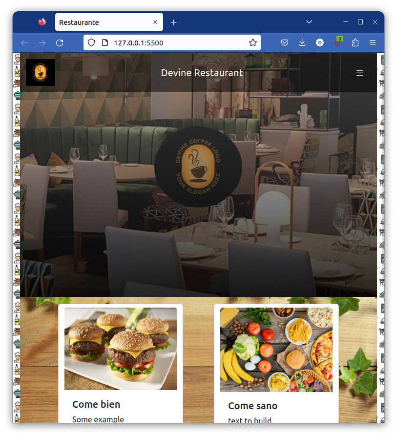
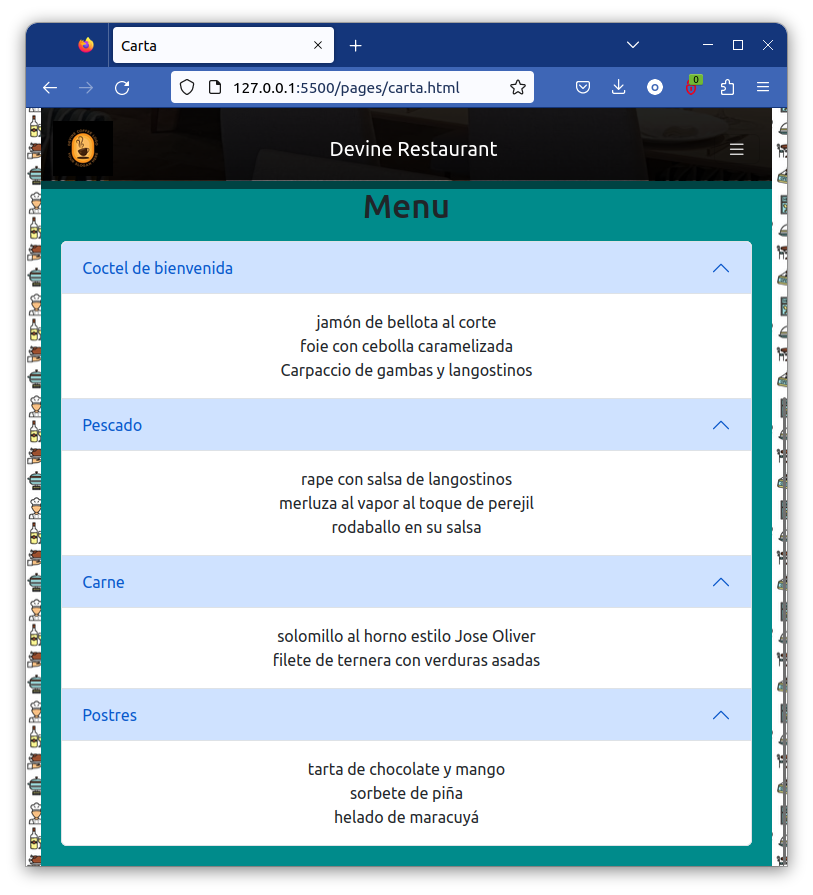
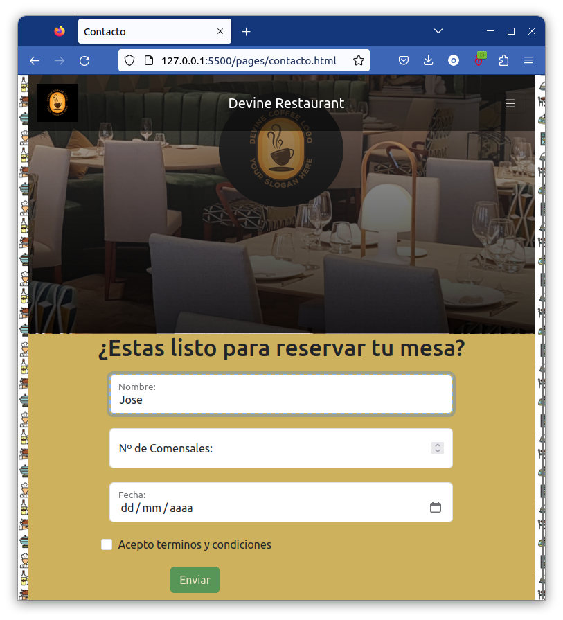

# proyecto-2-carta-restaurante
Proyecto nº2 del bootcamp, emula una **carta para restaurante**, utilizando HTML, CSS, bootstrap y una pizca de javascript.  
  
La página es full responsive, consta de una pagina principal, una pagina que muestra la carta y finalmente otra pagina con un formulario de contacto.  

Las paginas son accesibles desde los primeros enlaces en la barra de busqueda:  
Indice: https://joseoliver.github.io/proyecto-2-carta-restaurante/index.html
  
Tiene de especial:  
- Menu colapsable
- Imagen de cabecera responsive
- Cards de información con animaciones

Carta: https://joseoliver.github.io/proyecto-2-carta-restaurante/pages/carta.html
  
Tiene de especial:  
- Cabecera del mismo estilo
- Acordeon colapsable para la carta

Contacto: https://joseoliver.github.io/proyecto-2-carta-restaurante/pages/contacto.html
  
Tiene de especial:  
- Cabecera del mismo estilo
- Formulario con pre-validación
- Submit bloqueado hasta tener introducidos todos los campos
- Toast de verificación al realizar un submit correcto